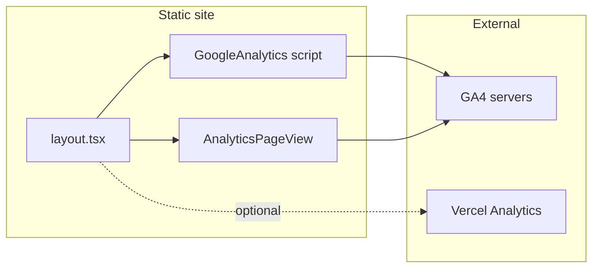

# Data Analytics — Setup and Reference

This document is the single reference for implementing and configuring portfolio analytics. It is intended for LLMs and agents: use section numbers and exact identifiers (env vars, file paths, event names) when implementing or verifying.

**Spec authority:** [TECHNICAL_SPECIFICATION.md](TECHNICAL_SPECIFICATION.md) §4.7 Data Analytics.

---

## 1. Overview

- **Goal:** After deployment, view website traffic and stats (page views, referrers, devices, top pages, optional custom events).
- **Constraint:** Client-side only. No backend or database. Scripts in the app send events to external services; the owner views reports in those services’ dashboards.
- **Stack:** Google Analytics 4 (GA4) for traffic and behavior; optional Vercel Analytics for Web Vitals and extra page views.

---

## 2. Environment and Configuration

### 2.1 Required environment variable

| Name | Scope | Example | Notes |
|------|--------|---------|--------|
| `NEXT_PUBLIC_GA_MEASUREMENT_ID` | Public (safe to expose) | `G-XXXXXXXXXX` | GA4 Measurement ID. If unset, GA script must not load (dev/local runs without GA). |

### 2.2 Where to set it

- **Local:** `.env.local` in project root (do not commit).
- **Vercel:** Project → Settings → Environment Variables. Add `NEXT_PUBLIC_GA_MEASUREMENT_ID` for Production (and Preview if desired).
- **Example file:** Repo should include `.env.example` with: `NEXT_PUBLIC_GA_MEASUREMENT_ID=G-XXXXXXXXXX`.

### 2.3 How to obtain the GA4 Measurement ID

1. Go to [analytics.google.com](https://analytics.google.com).
2. Create or select a GA4 property for this portfolio.
3. Admin → Data Streams → Web stream (or create one). Copy the **Measurement ID** (format `G-XXXXXXXXXX`).

---

## 3. Implementation Checklist (for agents)

Use this list when implementing or verifying analytics. All paths are relative to project root.

- [ ] **Env:** `.env.example` exists with `NEXT_PUBLIC_GA_MEASUREMENT_ID=G-XXXXXXXXXX`.
- [ ] **Layout:** `src/app/layout.tsx` includes GA script injection and optional `<Analytics />` (Vercel). GA script loads only when `NEXT_PUBLIC_GA_MEASUREMENT_ID` is set.
- [ ] **Script strategy:** Next.js `Script` with `strategy="afterInteractive"` or `lazyOnload` so analytics do not block initial paint.
- [ ] **GA component:** Script init and `gtag` config in a dedicated component (e.g. `src/components/GoogleAnalytics.tsx`) or `src/lib/gtag.ts` plus a layout-included component. Declare `window.gtag` for TypeScript if needed.
- [ ] **Page views:** Client component (e.g. `src/components/AnalyticsPageView.tsx`) uses `usePathname()`, and in `useEffect` sends `gtag('event', 'page_view', { page_path: pathname })` on pathname change and on mount. Rendered once from root layout.
- [ ] **Resume (optional):** On resume page download button click, call `gtag('event', 'resume_download')`.
- [ ] **Optional:** `@vercel/analytics` installed and `<Analytics />` in root layout.
- [ ] **Optional:** `src/lib/analytics.ts` with helpers e.g. `trackOutboundClick(url)`, `trackEvent(name, params)` for CTAs and outbound links (GitHub, LinkedIn, mailto).
- [ ] **Docs:** README or deployment notes mention setting `NEXT_PUBLIC_GA_MEASUREMENT_ID` in Vercel and optionally enabling Vercel Analytics.

---

## 4. Stats Available After Deployment

**In GA4 report:**

- Traffic: page views, unique visitors, sessions, bounce rate.
- Acquisition: referrers (Google, LinkedIn, direct, etc.), source/medium.
- Behavior: top pages, project detail views, flow.
- Audience (aggregate): countries, devices, browsers, screen sizes.
- Custom events (if implemented): e.g. `resume_download`, CTA clicks, `outbound_click`.

**In Vercel dashboard (if Vercel Analytics enabled):**

- Web Vitals: LCP, FID, CLS.
- Page view counts.

---

## 5. Data Flow (reference)

---

## 6. File and Identifier Reference

| Artifact | Location or value |
|----------|--------------------|
| GA env var | `NEXT_PUBLIC_GA_MEASUREMENT_ID` |
| GA page_view event | `gtag('event', 'page_view', { page_path: pathname })` |
| Resume download event name | `resume_download` |
| GA script strategy | `afterInteractive` or `lazyOnload` |
| Root layout | `src/app/layout.tsx` |
| GA script/init component | `src/components/GoogleAnalytics.tsx` or `src/lib/gtag.ts` + component |
| Page-view client component | `src/components/AnalyticsPageView.tsx` |
| Optional helpers | `src/lib/analytics.ts` |
| Setup doc | `docs/ANALYTICS.md` (this file) |
| Spec section | TECHNICAL_SPECIFICATION.md §4.7 |
