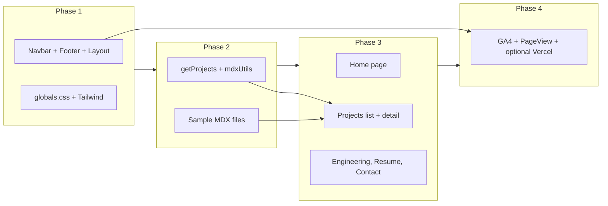

# PORTFOLIO WEBSITE — TECHNICAL SPECIFICATION

**Version:** 1.0  
**Owner:** Linshengyi Sun  
**Role Positioning:** Full-Stack Engineer with Automation & Reliability Focus

---

## 1. SYSTEM OVERVIEW

### 1.1 Objective

Build a production-grade static personal portfolio website that:

- Showcases engineering case studies
- Demonstrates system design and reliability thinking
- Highlights automation and CI/CD experience
- Converts recruiters into interview requests

The system must be:

- Static-rendered (SEO-friendly)
- Fast (Lighthouse >= 90)
- Modular
- Maintainable
- Structured for LLM parsing
- No backend required

---

## 2. TECHNOLOGY STACK

### 2.1 Framework

- Next.js 14+ (App Router)
- TypeScript
- TailwindCSS
- MDX (for project case studies)

### 2.2 Deployment

- Vercel (recommended)
- Alternative: Cloudflare Pages
- Must support static export

**Static export:** Use `output: 'export'` in `next.config.js` so the site builds as a static export. Do not use `getServerSideProps` or dynamic server routes.

### 2.3 Constraints

- No server-side database
- No authentication
- No backend form processing
- Must run as static site
- Analytics: client-side only (scripts send events to external services; no backend or DB for analytics)

---

## 3. ROUTING STRUCTURE

**Exact routes (single source of truth):**

| Path | Description |
|------|-------------|
| `/` | Home |
| `/projects` | Projects list |
| `/projects/[slug]` | Project detail (slug from MDX filename) |
| `/engineering` | Engineering philosophy |
| `/resume` | Resume page |
| `/contact` | Contact links |

Optional: `/blog`

Do not use `/project`, `/projects/:id`, or other variants.

---

## 4. FEATURE SPECIFICATION

### 4.1 HOME PAGE

**Purpose:** Provide immediate clarity about who the engineer is, what systems they build, measurable impact, and a clear call-to-action.

#### Required Sections

**1. Hero Section**

- H1 headline
- Subheadline
- Primary CTA button: "View Projects" → links to `/projects`
- Secondary CTA button: "Download Resume" → links to `/resume` or direct PDF download

**Done when:** H1 + subheadline + 2 CTAs render; primary CTA links to `/projects`, secondary to `/resume` or PDF download.

**2. Proof Strip**

- Display 3–5 quantified metrics in a horizontal strip
- Example format: "Reduced regression effort by 6+ hours per week", "Improved content verification efficiency by 30%", etc.
- Must be concise and horizontally aligned

**Done when:** 3–5 metrics in a horizontal strip; responsive (stack or scroll on small screens).

**3. Featured Projects**

- Display 3 project cards
- Each card: Title, tech stack, 1-sentence problem description, 1 measurable outcome, link to project detail page
- Data from `getProjects()` with `featured: true`

**Done when:** Exactly 3 cards; each has title, stack, 1-line problem, 1-line impact, link to `/projects/[slug]`; data from `getProjects()` with `featured: true`.

**4. Engineering Philosophy Preview**

- Display 3 principles: Reliability-first, Observability-driven, Automation-centric

**5. Footer**

- GitHub, LinkedIn, Email, Resume link

---

### 4.2 PROJECTS PAGE

**Purpose:** List all major engineering work in structured format.

**Functional requirements:**

- Tag filtering support
- Each project displays: Title, stack, 1-line problem, 1-line impact, link to detail page

**Tags (only these five):** `Full-Stack`, `Automation`, `DevOps`, `Distributed Systems`, `Infrastructure`

**Done when:** All projects from content visible; tag filter updates visible list; each row/card links to detail.

---

### 4.3 PROJECT DETAIL PAGE

**Content source:** Each project is defined in an MDX file.

**Slug rule:** The `slug` in metadata must match the MDX filename without `.mdx` (e.g. `enterprise-content-pipeline.mdx` → `slug: "enterprise-content-pipeline"`). This keeps routing and `getProjects()` deterministic.

**Section heading order (fixed for LLM parsing):** Each project detail page must use this exact order of top-level sections so parsers can extract by heading:

1. TL;DR  
2. Problem  
3. Architecture  
4. Engineering Decisions  
5. Implementation Details  
6. Results  
7. Future Improvements  

#### Required Sections (Strict Order)

**1. TL;DR** — 3–5 bullet summary; include stack and measurable impact.

**2. Problem** — Initial pain point, who was impacted, constraints.

**3. Architecture** — Diagram (image or ASCII), data flow, services involved.

**4. Engineering Decisions** — Tradeoffs, alternatives considered, why chosen solution, risk mitigation.

**5. Implementation Details** — Retry logic (if applicable), CI/CD integration, test coverage, performance, failure handling.

**6. Results** — Quantified impact, reliability improvements, developer efficiency improvements.

**7. Future Improvements** — Scalability, observability, refactoring ideas.

**Done when:** Single MDX renders with all 7 sections in order; diagram has `alt` text.

---

### 4.4 ENGINEERING PAGE

**Purpose:** Demonstrate systems thinking and reliability engineering depth.

**Required sections:**

- **Reliability Engineering** — CI gating, flaky test stabilization, root cause analysis, incident response strategy
- **System Design Philosophy** — Tradeoff analysis, idempotency, backoff strategy, feature flags, safe deployment
- **Automation Strategy** — Modular test framework, reusable utilities, parallel execution, environment isolation

---

### 4.5 RESUME PAGE

- Embedded PDF viewer
- Download button
- Short highlight summary (3–5 bullets)

**Done when:** PDF visible in-browser; download button works; 3–5 bullet summary above or beside.

---

### 4.6 CONTACT PAGE

- Email link (mailto), LinkedIn link, GitHub link
- No backend form; must be static

**Done when:** Only mailto, LinkedIn, GitHub; no form, no API.

---

### 4.7 DATA ANALYTICS

**Purpose:** Enable post-deployment visibility into website traffic and stats (page views, referrers, devices, top pages, optional custom events). All analytics are client-side only; no backend or database in the repo.

**Constraint:** Static export and "no backend" mean analytics must be client-side: a script sends events to an external service; the owner views stats in that service’s dashboard.

**Stack (single source of truth):**

- **Traffic and behavior:** Google Analytics 4 (GA4). Free. Provides: page views, unique visitors, sessions, bounce rate; acquisition (referrers, source/medium); behavior (top pages, flow); audience (countries, devices, browsers).
- **Optional:** Vercel Analytics (`@vercel/analytics`). Free on Vercel. Provides: Web Vitals (LCP, FID, CLS), page view counts in Vercel dashboard.
- **Environment:** One public env var: `NEXT_PUBLIC_GA_MEASUREMENT_ID` (format `G-XXXXXXXXXX`). Load GA script only when this is set so dev/local runs without GA.

**Required implementation:**

- **Root layout** (`src/app/layout.tsx`): Include GA script injection conditional on `NEXT_PUBLIC_GA_MEASUREMENT_ID`. Use Next.js `Script` with `strategy="afterInteractive"` (or `lazyOnload`) so analytics do not block initial paint.
- **Page views:** Send GA4 `page_view` on route change and on mount. Use a client component that calls `usePathname()` and in a `useEffect` sends `gtag('event', 'page_view', { page_path: pathname })` when pathname changes. Rendered once from root layout. Covers: `/`, `/projects`, `/projects/[slug]`, `/engineering`, `/resume`, `/contact`.
- **Files:** Script init and injection in a dedicated component (e.g. `src/components/GoogleAnalytics.tsx`) or `src/lib/gtag.ts` plus a small layout component; page-view logic in a client component (e.g. `src/components/AnalyticsPageView.tsx`). No server components or API routes; compatible with `output: 'export'`.

**Optional implementation:**

- **Vercel Analytics:** Add `@vercel/analytics` and render `<Analytics />` in root layout.
- **Custom events:** Resume download: on download button click, send `gtag('event', 'resume_download')`. CTAs: optional events for "View Projects", "Download Resume", "Contact". Outbound links: optional utility (e.g. `src/lib/analytics.ts`) with `trackOutboundClick(url)` / `trackEvent(name, params)` for GitHub, LinkedIn, mailto clicks.

**Documentation:** Setup and env are documented in [docs/ANALYTICS.md](docs/ANALYTICS.md). README or deployment notes must mention setting `NEXT_PUBLIC_GA_MEASUREMENT_ID` in Vercel (and optionally enabling Vercel Analytics in project settings).

**Done when:** GA4 script loads when env is set; page_view fires on every route change and mount; stats are visible in GA4 report after deployment; optional Vercel Analytics and custom events implemented if specified; docs/ANALYTICS.md and env reference in README exist.

---

## 5. FOLDER STRUCTURE

```
portfolio/
├── public/
│   ├── images/
│   │   ├── projects/
│   │   └── diagrams/
│   ├── resume.pdf
│   └── favicon.ico
│
├── src/
│   ├── app/
│   │   ├── layout.tsx
│   │   ├── page.tsx
│   │   ├── projects/
│   │   │   ├── page.tsx
│   │   │   └── [slug]/
│   │   │       └── page.tsx
│   │   ├── engineering/
│   │   │   └── page.tsx
│   │   ├── resume/
│   │   │   └── page.tsx
│   │   └── contact/
│   │       └── page.tsx
│   ├── components/
│   │   ├── Navbar.tsx
│   │   ├── Footer.tsx
│   │   ├── ProjectCard.tsx
│   │   ├── ProofStrip.tsx
│   │   ├── CTASection.tsx
│   │   ├── TagBadge.tsx
│   │   ├── GoogleAnalytics.tsx
│   │   └── AnalyticsPageView.tsx
│   ├── content/
│   │   └── projects/
│   │       ├── enterprise-content-pipeline.mdx
│   │       ├── automation-framework.mdx
│   │       └── admin-dashboard-redesign.mdx
│   ├── lib/
│   │   ├── getProjects.ts
│   │   ├── mdxUtils.ts
│   │   └── analytics.ts
│   └── styles/
│       └── globals.css
│
├── docs/
│   ├── TECHNICAL_SPECIFICATION.md
│   ├── NOTION_SETUP.md
│   └── ANALYTICS.md
├── .env.example
├── tailwind.config.ts
├── next.config.js
├── package.json
└── README.md
```

---

## 6. PROJECT METADATA STRUCTURE

Each MDX file must export structured metadata that conforms to the following interface. **Slug must match the filename** (without `.mdx`).

**TypeScript contract (single source of truth):**

```ts
// types/project.ts (or in lib as reference)
export interface ProjectMetadata {
  title: string;
  slug: string;
  stack: string[];
  tags: ("Full-Stack" | "Automation" | "DevOps" | "Distributed Systems" | "Infrastructure")[];
  featured: boolean;
  impact: string;
}
```

**Example in MDX:**

```ts
export const metadata = {
  title: "Enterprise Multimedia Distribution Pipeline",
  slug: "enterprise-content-pipeline",
  stack: ["React", ".NET Core", "AWS S3", "CDN"],
  tags: ["Full-Stack", "Distributed Systems"],
  featured: true,
  impact: "Reduced manual verification time by 30%"
};
```

This enables automatic listing, tag filtering, featured section, and SEO generation.

---

## 7. IMPLEMENTATION ORDER AND DEPENDENCIES

Follow this order so tasks have clear sequence and dependencies.



- **Phase 1:** Layout, Navbar, Footer, `globals.css`, Tailwind theme (accent, neutrals).
- **Phase 2:** `lib/getProjects.ts`, `lib/mdxUtils.ts`, 1–2 sample MDX files with full metadata.
- **Phase 3:** Home (hero, proof strip, featured projects, philosophy, footer), then `/projects`, `/projects/[slug]`, then `/engineering`, `/resume`, `/contact`.
- **Phase 4:** Data analytics: GA4 script and init (conditional on `NEXT_PUBLIC_GA_MEASUREMENT_ID`), AnalyticsPageView client component, optional Vercel Analytics and custom events; `docs/ANALYTICS.md` and `.env.example`.

---

## 8. PERFORMANCE REQUIREMENTS

- Lighthouse >= 90
- Static rendering
- Image optimization (WebP, next/image)
- No unnecessary animation libraries
- Minimal client-side JS

---

## 9. DESIGN SYSTEM RULES

- **Typography:** Inter or system font; clear heading hierarchy
- **Spacing:** Generous whitespace; max-width container
- **Color:** 1 accent color; neutral base palette; dark mode optional

---

## 10. LLM PARSING OPTIMIZATION RULES

- Use semantic HTML
- Use structured headings: Problem, Architecture, Engineering Decisions, Results
- Avoid vague storytelling
- Use explicit section labels
- Provide alt text for diagrams
- Keep MDX content structured
- Use fixed section heading order on project detail pages (see §4.3)
- **Sitemap:** Generate static `sitemap.xml` for `/`, `/projects`, `/projects/[slug]`, `/engineering`, `/resume`, `/contact` (e.g. from `getProjects()` + static routes) for discovery and SEO
- **Analytics:** See §4.7 for data analytics (GA4, optional Vercel Analytics); implementation and env in [docs/ANALYTICS.md](docs/ANALYTICS.md)

---

## 11. DONE WHEN (ACCEPTANCE CRITERIA SUMMARY)

| Section | Done when |
|--------|------------|
| Hero | H1 + subheadline + 2 CTAs render; primary CTA → `/projects`, secondary → `/resume` or PDF download |
| Proof strip | 3–5 metrics in horizontal strip; responsive (stack or scroll on small screens) |
| Featured projects | Exactly 3 cards; title, stack, 1-line problem, 1-line impact, link to `/projects/[slug]`; data from `getProjects()` with `featured: true` |
| Projects list | All projects from content; tag filter updates list; each row links to detail |
| Project detail | Single MDX renders with all 7 sections in order; diagram has `alt` text |
| Resume | PDF visible in-browser; download button; 3–5 bullet summary above or beside |
| Contact | Only mailto, LinkedIn, GitHub; no form, no API |
| Data analytics | GA4 script loads when `NEXT_PUBLIC_GA_MEASUREMENT_ID` set; page_view on route change/mount; stats visible in GA4 after deploy; optional Vercel Analytics/custom events per spec; docs/ANALYTICS.md and env in README |
